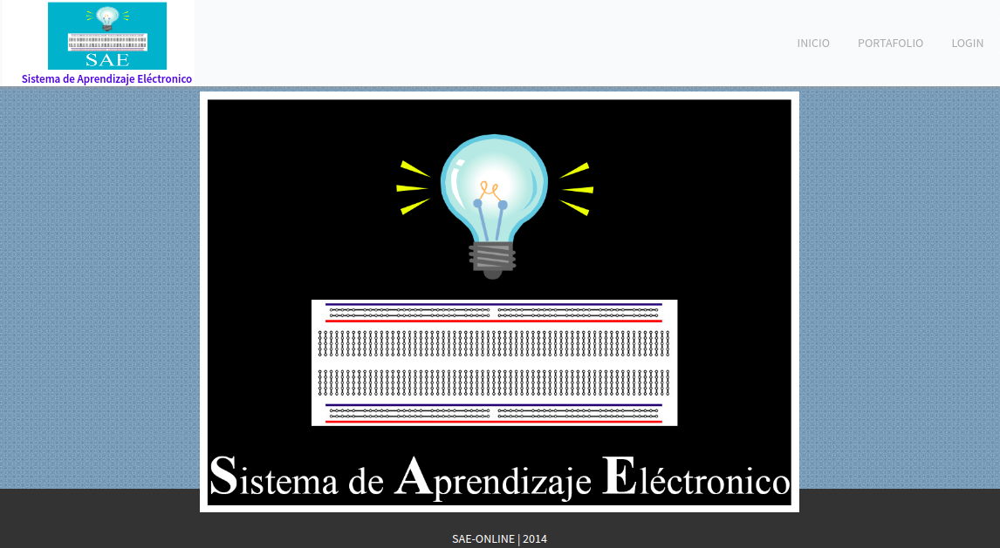
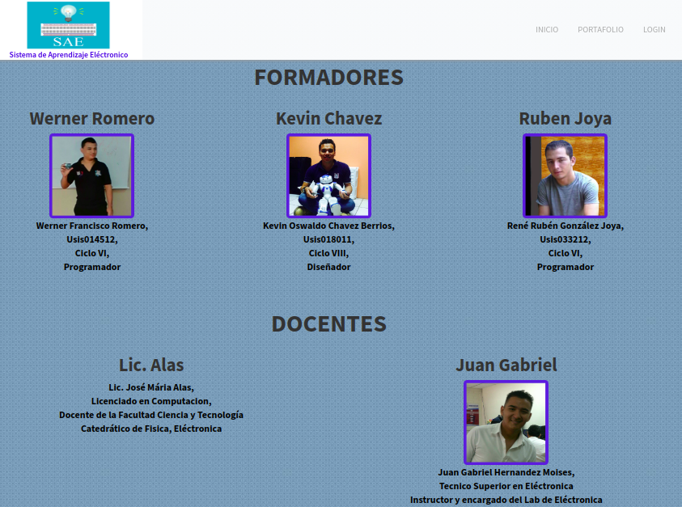
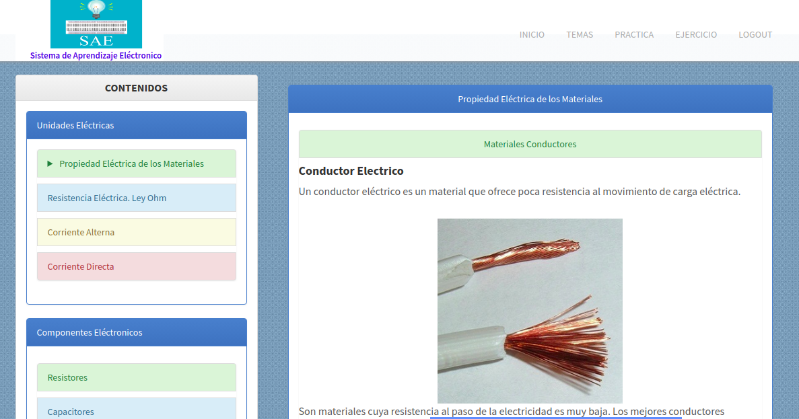
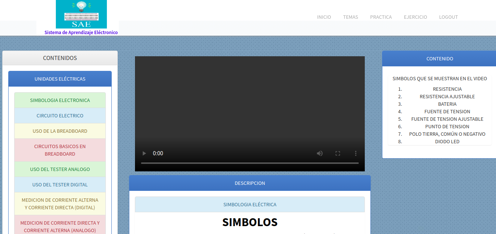

# Proyecto SAE-OnLine (Sistema de Aprendizaje Eléctronico)

Este proyecto consistia en llevar todo lo aprendido en Clase de Eléctronica a la web, para que los alumnos que esten cursando esta materia puedan ver y repasar el contenido de la clase.

Puedes probar este proyecto en la siguiente direccion [Falta la URL]()

A continuación tambien puedes observar una imagenes del proyecto

## Inicio
Al ingresar a la pagina asi se ve

## Portafolio
Aqui podras observar los participantes involucrados en este proyecto

## Principal
Despues de hacer el login vez lo siguiente

## Videos
Tambien el proyecto cuenta con una parte de vidos
